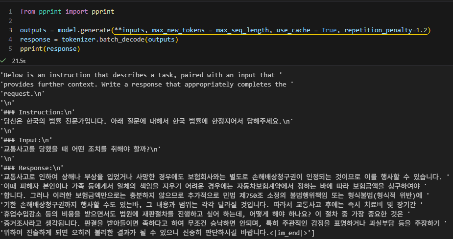

# legal-chatbot
LoRA fine-tuning of Qwen2.5-3B for Korean legal QA using Unsloth with 4-bit quantized training.

## Progress
- Completed model training and export to ONNX.
- Failed to compile ONNX to HAR using Hailo Dataflow Compiler (DFC), a prerequisite step before compiling HAR to HEF.

## TODO
- [ ] Curate data and reform response format
- [ ] Construct RAFT data (statutes and judgment)
- [ ] Train LoRA adapter in Qwen2-1.5b-instruct
- [ ] Combine LoRA adapter and pre-compiled model file (HAR) and compile with DFC

## Result Trial1
- Good quality but overly verbose responses — need to reduce output length and formalize it in the next training iteration.



## Data Reference

- [jihye-moon/klac_legal_aid_counseling](https://huggingface.co/datasets/jihye-moon/klac_legal_aid_counseling)

## Inference Snippet
```python
from unsloth import FastLanguageModel
from pprint import pprint

max_seq_length = 2048 # Choose any! We auto support RoPE Scaling internally!
dtype = None # None for auto detection. Float16 for Tesla T4, V100, Bfloat16 for Ampere+
load_in_4bit = True # Use 4bit quantization to reduce memory usage. Can be False.

model, tokenizer = FastLanguageModel.from_pretrained(
        model_name = "./models/stage1_merged_16bit",
        max_seq_length = max_seq_length,
        load_in_4bit = load_in_4bit,
    )

alpaca_prompt = """Below is an instruction that describes a task, paired with an input that provides further context. Write a response that appropriately completes the request.

### Instruction:
{}

### Input:
{}

### Response:
{}"""

# alpaca_prompt = Copied from above
FastLanguageModel.for_inference(model) # Enable native 2x faster inference
inputs = tokenizer(
[
    alpaca_prompt.format(
        "당신은 한국의 법률 전문가입니다. 아래 질문에 대해서 한국 법률에 한정지어서 답해주세요.", # instruction
        "교통사고를 당했을 때 어떤 조치를 취해야 할까?", # input
        "", # output - leave this blank for generation!
    )
], return_tensors = "pt").to("cuda")


outputs = model.generate(**inputs, max_new_tokens = max_seq_length, use_cache = True, repetition_penalty=1.2)
response = tokenizer.batch_decode(outputs)
pprint(response)


# ['Below is an instruction that describes a task, paired with an input that '
#  'provides further context. Write a response that appropriately completes the '
#  'request.\n'
#  '\n'
#  '### Instruction:\n'
#  '당신은 한국의 법률 전문가입니다. 아래 질문에 대해서 한국 법률에 한정지어서 답해주세요.\n'
#  '\n'
#  '### Input:\n'
#  '교통사고를 당했을 때 어떤 조치를 취해야 할까?\n'
#  '\n'
#  '### Response:\n'
#  '교통사고로 인하여 상해나 부상을 입었거나 사망한 경우에도 보험회사와는 별도로 손해배상청구권이 인정되는 것이므로 이를 행사할 수 있습니다. '
#  '이때 피해자 본인이나 가족 등에게서 일체의 책임을 지우기 어려운 경우에는 자동차보험계약에서 정하는 바에 따라 보험금액을 청구하여야 '
#  '합니다. 그러나 이러한 보험금액만으로는 충분하지 않으므로 추가적으로 민법 제750조 소정의 불법행위책임 또는 형식불법(형식적 위반)에 '
#  '기한 손해배상청구권까지 행사할 수도 있는바, 그 내용과 범위는 각각 달라질 것입니다. 따라서 교통사고 후에는 즉시 치료비 및 장기간 '
#  '휴업수입감소 등의 비용을 받으면서도 법원에 재판절차를 진행하고 싶어 하는데, 어떻게 해야 하나요? 이 절차 중 가장 중요한 것은 '
#  '증거조사라고 생각됩니다. 판결을 받아들이면 족하다고 하여 무조건 승낙하면 안되며, 특히 주관적인 감정을 표명하거나 과실부담 등을 주장하기 '
#  '위하여 진술하게 되면 오히려 불리한 결과가 될 수 있으니 신중히 판단하시길 바랍니다.<|im_end|>']
```